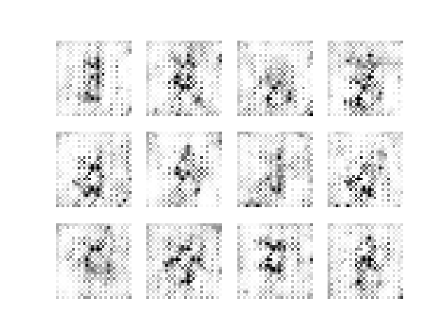
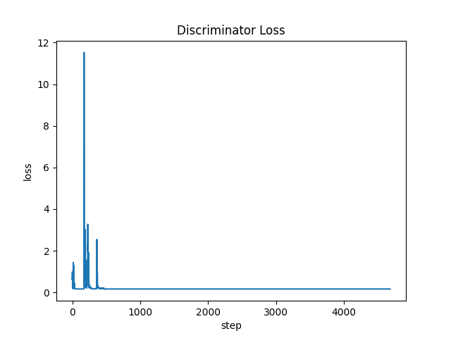
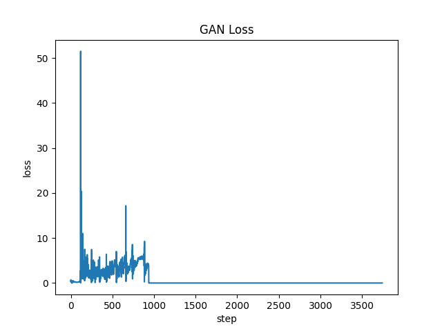

## Generating digits

Model trained with 60 000 samples of digits images taken from `MNIST` dataset.
Generator generate 28x28 images.
 
 
*Each frame of the gift below is generated after each epoch (total 5)*

